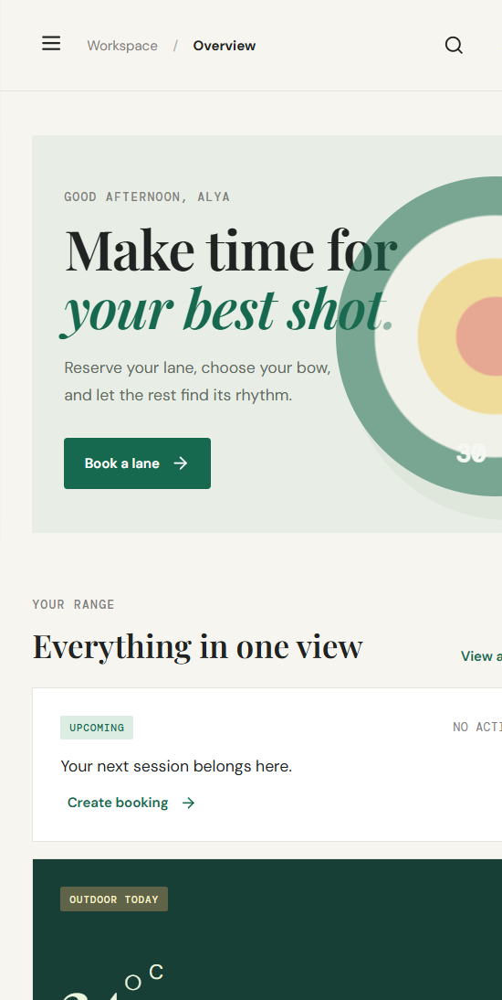
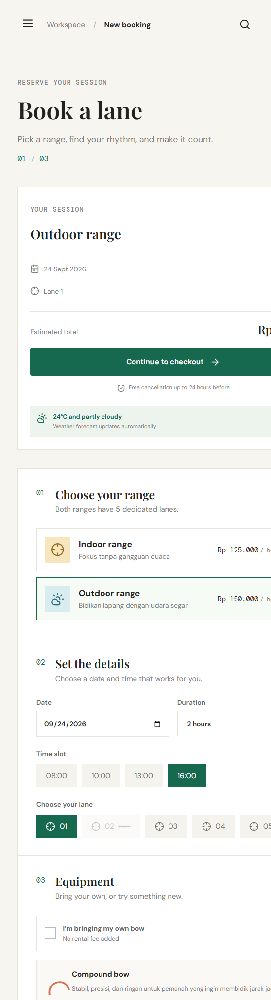

# C'Archery Web

Booking management system untuk klub panahan C'Archery. Member dapat memilih range indoor/outdoor, lane, tanggal, durasi, dan equipment; admin memiliki desk untuk memantau seluruh booking.

## Tech stack
- React 18 + Vite
- Lucide React icons
- CSS responsive dengan DM Sans, DM Mono, dan Playfair Display
- REST API backend di `crack-be-CleveinE`

## Run locally
```bash
npm install
npm run dev
```
Buka `http://localhost:5173`. Pastikan API berjalan di `http://localhost:4000` atau buat `.env` dari `.env.example`.

## Demo accounts
- Member: `alya@carchery.id` / `password`
- Admin: `admin@carchery.id` / `password`

## Main flows
Guest -> Sign in/Register -> Overview -> New booking -> pilih range, tanggal, waktu, lane, durasi, equipment -> Continue to checkout.
My bookings menampilkan riwayat, search, status filter, dan cancellation action. Admin desk menampilkan seluruh booking serta CRUD bow rental setelah login admin.

## Project structure
- `src/App.jsx`: application shell and member booking flow
- `src/components/AdminPanel.jsx`: authenticated admin catalog CRUD
- `src/main.jsx`: React bootstrap
- `src/styles.css`, `src/ui-states.css`, `src/admin-styles.css`: responsive visual system and state styles

## Deployment
Deploy folder ini ke Vercel/Netlify sebagai Vite app. Set environment variable `VITE_API_URL` ke URL backend yang sudah dideploy, misalnya `https://carchery-api.onrender.com/api`, lalu trigger redeploy.

Vercel settings: Framework `Vite`, Build command `npm run build`, Output directory `dist`. Konfigurasi yang sama tersedia di `vercel.json`.

## Rubric checklist
- Responsive member dashboard, booking flow, booking history, cancellation, search, weather, and admin desk.
- Two roles: `user` and `admin`; the admin navigation is protected by the authenticated role returned by the API.
- Loading state, API error notices, empty states, form validation, and mobile navigation are included.
- Service/range data is loaded from the backend; no booking data is hard-coded in the UI.

## Deployment links
- Frontend: `https://carchery-web.vercel.app` (replace with the team's actual deployment URL)
- Backend API: `https://carchery-api.onrender.com` (replace with the team's actual deployment URL)

## Screenshots


